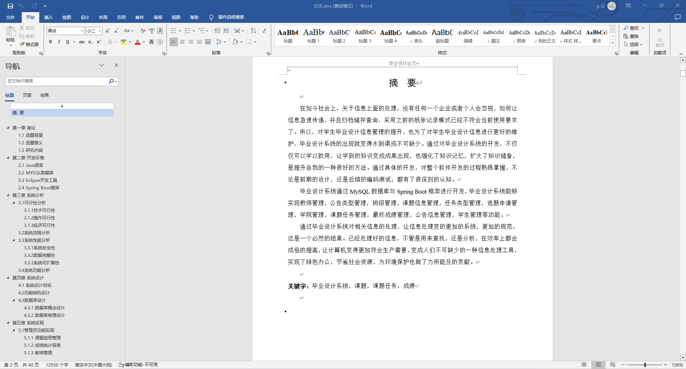
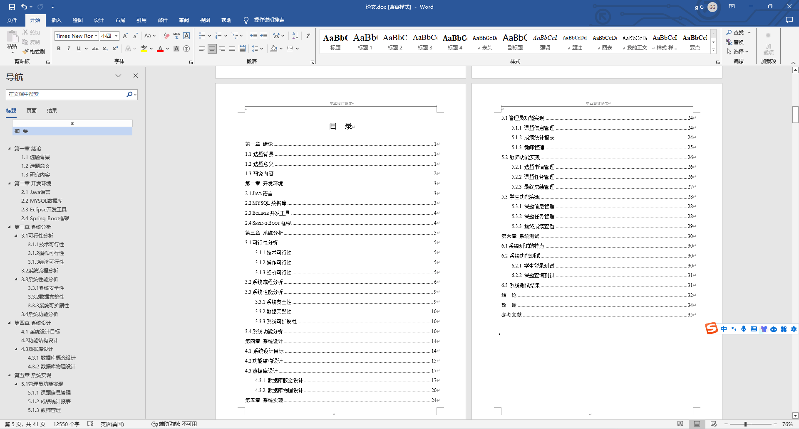
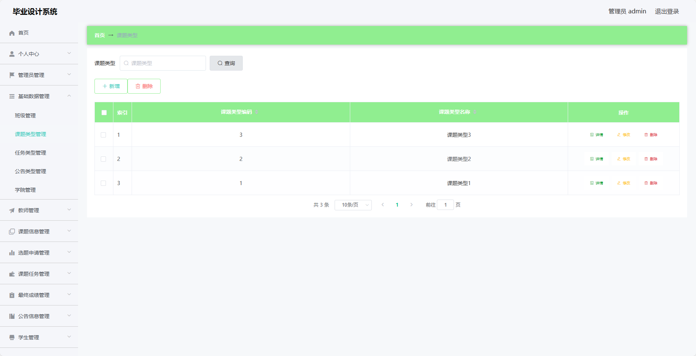
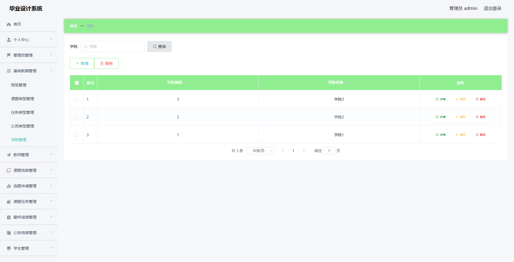
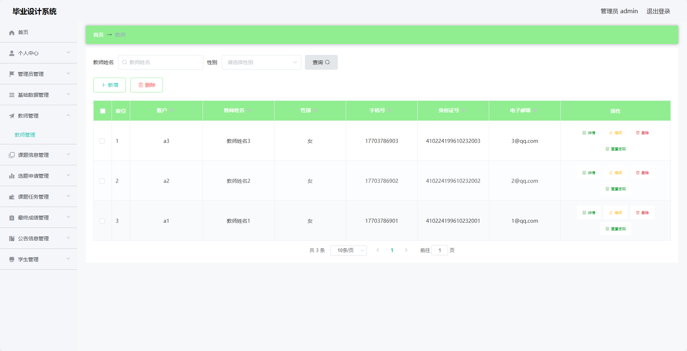
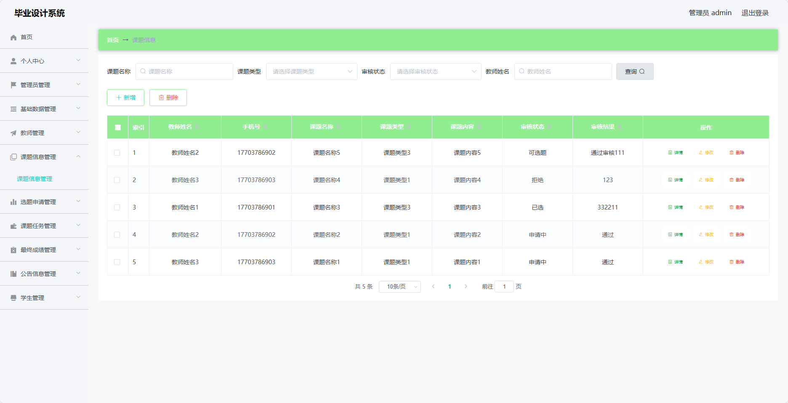
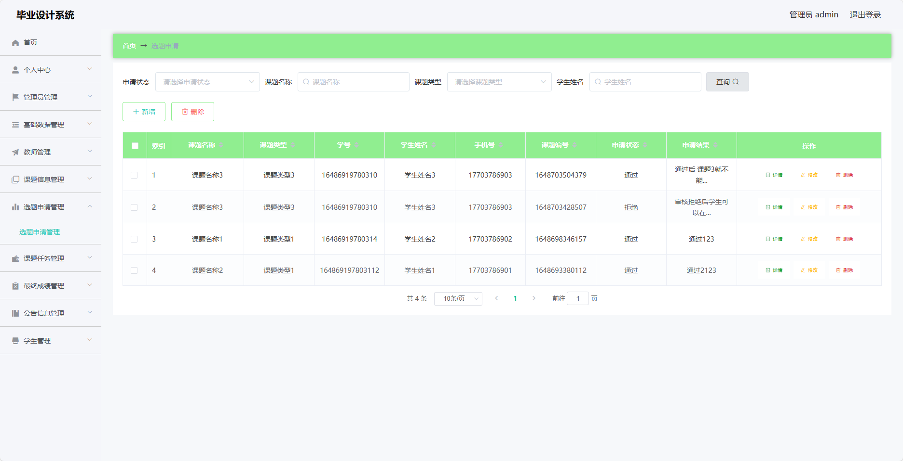
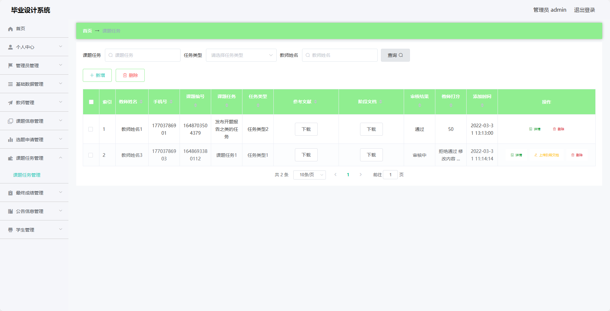
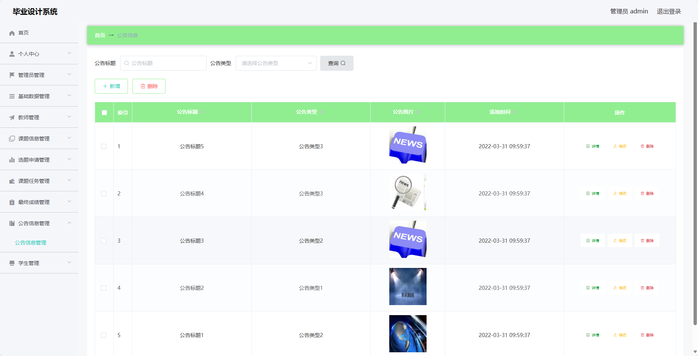
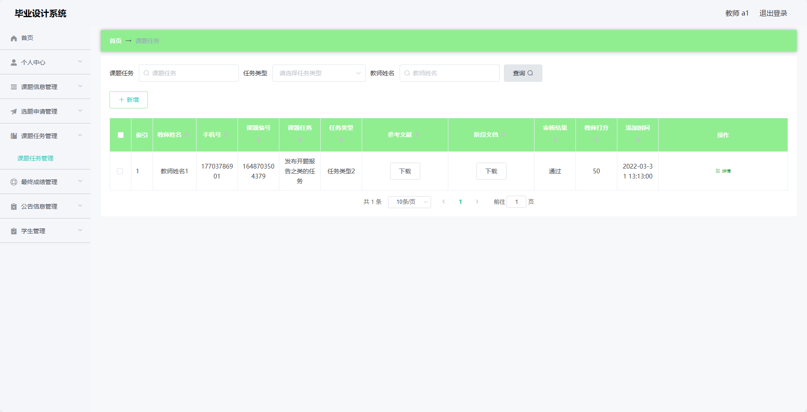

基于SpringBoot的毕业设计系统（程序+论文）
=
- 完整代码获取地址：从戎源码网 ([https://armycodes.com/](https://armycodes.com/))
- 作者微信：19941326836  QQ：952045282 
- 承接计算机毕业设计、Java毕业设计、Python毕业设计、深度学习、机器学习
- 选题+开题报告+任务书+程序定制+安装调试+论文+答辩ppt 一条龙服务
- 所有选题地址https://github.com/nature924/allProject

一、项目介绍
---
基于Spring Boot框架实现的毕业设计系统，系统包含两种角色：管理员、教师、学生,系统分为前台和后台两大模块，主要功能如下。
### 后台：
### 管理员：
- 个人中心：管理个人信息。
- 管理员管理：管理系统中的管理员账号信息，包括添加、编辑、删除管理员等操作。
- 基础数据管理：管理系统中的基础数据，包括课程分类、学院信息等。
- 教师管理：管理系统中的教师信息，包括添加、编辑、删除教师等操作。
- 课题信息管理：管理系统中的课题信息，包括添加、编辑、删除课题等操作。
- 选题申请管理：管理学生的选题申请，包括审批选题申请等操作。
- 课题任务管理：管理课题的任务信息，包括添加、编辑、删除任务等操作。
- 最终成绩管理：管理学生的最终成绩，包括录入、修改成绩等操作。
- 公告信息管理：管理系统中的公告信息，包括发布、编辑、删除公告等操作。
- 学生管理：管理系统中的学生信息，包括添加、编辑、删除学生等操作。

### 教师：
- 个人中心：管理个人信息。
- 课题信息管理：管理教师发布的课题信息，包括添加、编辑、删除课题等操作。
- 选题申请管理：管理学生的选题申请。
- 课题任务管理：管理课题的任务信息，包括添加、编辑、删除任务等操作。
- 最终成绩管理：管理学生的最终成绩，包括录入、修改成绩等操作。
- 公告信息管理：管理系统中的公告信息，包括发布、编辑、删除公告等操作。
- 学生管理：管理教师负责的学生信息。

### 学生：
- 个人中心：管理个人信息。
- 课题信息管理：浏览系统中的课题信息。
- 选题申请管理：申请选择课题。
- 课题任务管理：查看课题任务信息。
- 最终成绩管理：查看个人的最终成绩。
- 公告信息：查看系统中的公告信息。

二、项目技术
---
- 编程语言：Java
- 数据库：MySQL
- 项目管理工具：Maven
- 前端技术：VUE、HTML、Jquery、Bootstrap
- 后端技术：Spring、SpringMVC、MyBatis

三、运行环境
---
- 操作系统：Windows、macOS都可以
- JDK版本：JDK1.8以上都可以
- 开发工具：IDEA、Ecplise、Myecplise都可以
- 数据库: MySQL5.7以上都可以
- Tomcat：任意版本都可以
- Maven：任意版本都可以

四、运行截图
---
### 论文截图：

### 程序截图：

